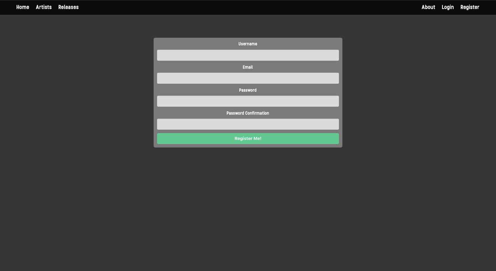
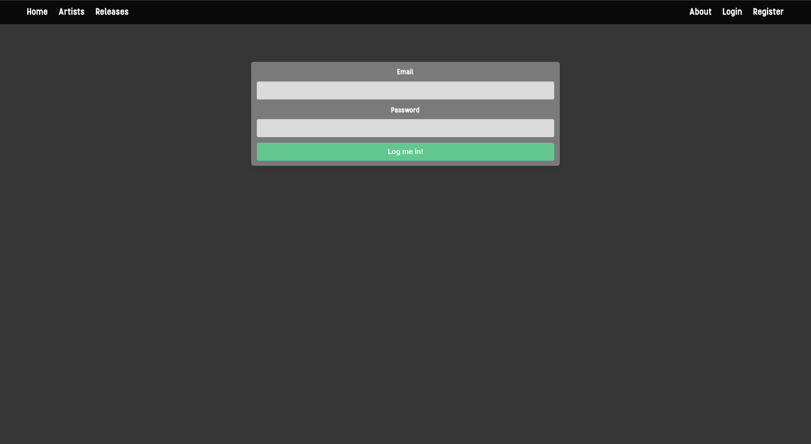
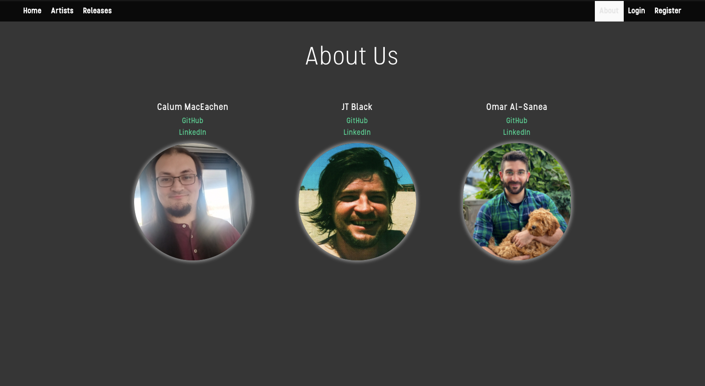

# Rateify

## Project Overview
   _Rateify_ is a full stack MERN application (MongoDB, Express, React and Node) .The site allows users to discover and rate music, post their own reviews about a release, and upload a release for others to comment on. The app also allows users to listen to samples of the posted music by listening to the release's associated Spotify playlist .  _Rateify_ was a week-long group project in which I worked with [Calum MacEachen](https://github.com/calum-m708) and [JT Black](https://github.com/JT-Black) to create our finished site. 

You can check it out for yourself [here!](https://rateify.netlify.app/) 
   

## The Brief
- Build a full-stack application by making a back-end and a front-end.
- Use an Express API to serve your data from a Mongo database.
- Consume your API with a separate front-end built with React. 
- Be a complete product with multiple relationships and CRUD functionality.
- Implement wireframes that show the user journey and functionality of the application.
- Be deployed online so it’s publicly accessible.

## Technologies Used 

### Front End
- React Framework (Single Page Application)
- API Handling: Axios
- Pure CSS with Sass
- React-Router-Dom

### Back End
- Server: Node.js & Express
- Database: MongoDB & Mongoose
- Safeguarding from injection attacks: Express Mongo Sanitize
- Password Encryption: Bcrypt
- Authentication: JSON Web Token (JWT)

### Development
- Git, GitHub
- Postman for API testing
- Excalidraw for wireframing
- Npm
- Deployment:
  - Front End: Netlify
  - Back End: Heroku (& Mongo Atlas)

## 1) Planning

Our first discussions centred around the fact that we wanted to build something that would be useful to people and that was different to other applications that we had built before. We focused on music as it was an area that we were all interested in and decided to create a site that blended musical content with user interaction for music fans looking to share their favorite releases and opinions about the music and artists who created it.

## 2) Back-End 

## 3) Front-End 

## 4) Styling

## Application Walkthrough
### Home  Page

### Artist Index

### Release Index

### Artist Page

### Release Page

### Register

	

### Login

	

### About

	

## Architecture:
### Front End: 
  - React Components using Hooks for state management and handling side effects
  - Bulma CSS framework for styling
  - Single Page Application (`react-router-dom`) using `Link`, `useNavigate`, `useLocation` and `useParams`
### Back End:
  - All security checks done in the back end:
    - Email validation
    - Password validation
  - Secure routing middleware
  - Error handling middleware
  - Interlinked schema models in MongoDB

## Challenges and Wins

Adding releases requires using a spotify link currently. An unsolved issue we had was a better way to add releases and artists that would validate, unfortunately we ran out of time. We wanted to add an average star rating and reviews section as well, however the time constraint limited what we were able to add with our deadline. We were able to add carousels on the homepage for a bit of fun movement.

# Wins & Blockers
### **Wins**
- First time using a variety of new technologies. 
- First time working in a group of more than two.
- Complete application that delivers many features as designed.
- Complete application that stronngly resembles the wireframes.

### **Blockers**
- The single biggest blocker was the variety of new technologies we had to use for this project and learning each of their idiosyncrasies. 

# Bugs
-After deployment registration has stopped working.

# Future Improvements
-Adding an average star rating and reviews section. 
-Fix the registration bug. 

# Key Takeaways
Building 'Rateify' was a great way to build my knowledge of new technologies and was also a great experience of working in a group as both Calum and JT were fatastic to work with. 

